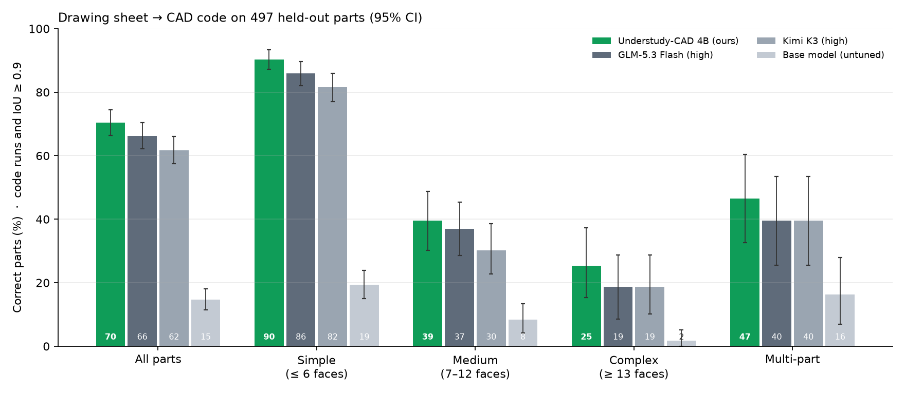
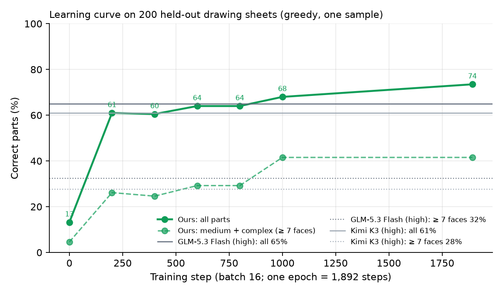

# Understudy-CAD

**A 4B vision model, post-trained on a Baseten H100, that reads an engineering drawing sheet and writes the CadQuery
program that builds the part. Graded by the geometry itself: every answer is executed and its solid is compared to
the reference with exact volumetric IoU.**

Frontier models turn explicit text specs into CAD almost perfectly (Kimi K3: 95% on our held-out parts). Real CAD
work starts from drawings, though, and from a 4-view drawing sheet the same models fall to 61–65%, and to 21–37% on
parts with more than six faces. Understudy trains a small model on exactly that job, serves it on Baseten, and races
it live against Kimi K3 and GLM-5.3 Flash on held-out parts.

## How it works

```
CAD-Coder (Apache-2.0) ─► audit: run ~83K reference programs  ─► clean splits, held out by source part
        │                                                            and deduplicated by geometry
        ▼
render every part as a drawing sheet: FRONT / TOP / RIGHT at one scale + isometric, bounding box as text
        │
        ▼
Baseten Training (1× H100): LoRA SFT of Qwen3-VL-4B-Instruct on 30,260 sheets -> CadQuery, loss on the code only
        │
        ▼
Baseten deployment: merged weights served by vLLM straight from the training job (training_checkpoints)
        │
        ▼
held-out sheet ─► sample N programs ─► render each like the input sheet, keep the best match (no answer key)
               ─► sandboxed CadQuery ─► IoU vs reference ─► scoreboard + 3D race
```

| Step | Baseten product |
|---|---|
| Frontier baselines (Kimi K3, GLM-5.3 Flash, both vision models, high reasoning effort) | Model APIs |
| Fine-tune Qwen3-VL-4B-Instruct on rendered drawing sheets | Training Jobs on 1× H100 |
| Serve our model (merged weights, or base + LoRA from any checkpoint) | Deployments that pull the training job's checkpoints, vLLM |
| Built with | Baseten Switch (Claude Code on open models) |

## Look at your data: what the audit found

`scripts/audit_cadcoder.py` runs every reference program and checks it against the size its own spec states.

- The **official test split's references disagree with their own spec 14% of the time** (single-part rows where
  the stated size is checkable) vs **2.3% for the curated `train_high` split**. So the benchmark is held out of
  `train_high`, grouped by source part (zero overlap with training), and every training part whose geometry
  (bounding box + face count) matches a benchmark part is dropped.
- References apply the specs' global rotations/translations inconsistently. The headline metric therefore aligns
  the two solids first (best IoU over the 24 axis rotations after centering). It stays size- and shape-sensitive:
  a part 10% too large scores 0.75.
- Drawing sheets sidestep the noisy text: each sheet is rendered from its own reference program, so input and
  answer always agree.
- Some reference programs wrote files to disk. The sandbox strips export calls and runs code in a throwaway directory.

## Benchmark rules

- **Same task for every lane:** one drawing sheet plus the bounding box. Frontier lanes additionally get two worked
  examples (sheet + program) and high reasoning effort; ours gets the zero-shot prompt it was trained on.
- **Output budget:** frontier lanes may use up to 16,384 output tokens (reasoning included). Kimi K3 hit that cap on
  2 of 200 parts; counting both as correct would move it from 61.0% to 62.0%.
- **Success = the code runs and aligned IoU ≥ 0.9.** Also reported: IoU ≥ 0.95, run rate, mean IoU, Chamfer
  distance, results by complexity (faces, parts), latency p50/p95, output tokens and $ per 1K parts.
- **Bootstrap 95% CIs**, fixed seeds. If the API returns no answer at all (402, 5xx, dropped connection after
  retries) the row is left out and listed, never scored as a wrong answer.
- **Best-of-N without an answer key.** Our lane may sample several programs and keep the one whose rendering best
  matches the *input* sheet and the stated bounding box (render-and-compare, `understudy/cad/verify.py`). On 689 real
  frontier answers it separates correct from wrong with AUC 0.96, and among several answers for the same part it
  picks a correct one 98% of the time (random: 76%). Frontier lanes can use the same verifier (`--best-of`).
- **Cost includes the GPU.** Our $/1K parts is the GPU's hourly price amortized over measured throughput.

## Results

Drawing sheets, held-out parts ([`data/demo/scoreboard.json`](data/demo/scoreboard.json), charts in `docs/`):

| Model | Correct overall [95% CI] | Simple (≤ 6 faces) | Medium (7–12) | Complex (≥ 13) | Multi-part | $ / 1K parts | Latency p50 |
|---|---|---|---|---|---|---|---|
| **Understudy-CAD 4B (ours)** | **70.4% [66–74]** | **90.3%** | **39.5%** | **25.4%** | **46.5%** | _serving run pending_ | _pending_ |
| GLM-5.3 Flash (high) | 66.2% [62–70] | 85.9% | 37.0% | 18.6% | 39.5% | $1.00 | 3.7 s |
| Kimi K3 (high) | 61.8% [58–66] | 81.5% | 30.3% | 18.6% | 39.5% | $36.82 | 10.4 s |
| Untuned Qwen3-VL-4B | 14.7% [11–18] | 19.4% | 8.4% | 1.7% | 16.3% | | |



All 500 held-out parts (322 simple, 119 medium, 59 complex; 43 multi-part).

**Learning curve** (greedy, the frontier's 200 parts): 13% untuned → 61% at step 200 → 68% at step 1000 → **73.5% after
one epoch**, vs GLM-5.3 Flash 65% and Kimi K3 61%; on medium/complex parts **41.5%** vs 32% / 28%.



**The verifier helps any model.** Best-of-4 with render-and-compare on the 65 medium/complex parts: Kimi K3 28% → 48%
($252 per 1,000 parts), GLM-5.3 Flash 32% → 46%. Text specs for comparison: Kimi K3 95.0%,
GLM-5.3 87.5% (40 parts, zero-shot). The full timeline, dead ends included, is in [WORKLOG.md](WORKLOG.md).

## Quickstart

```bash
uv sync                                              # Python 3.12, CadQuery, VTK, openai
cp .env.example .env                                 # add BASETEN_API_KEY
uv run python scripts/smoke.py                       # catalog, rate limit, one held-out part per lane
uv run python scripts/audit_cadcoder.py              # optional: re-run the data audit
uv run python -m understudy.cad.splits               # rebuild splits (deterministic); --extra2 for the second batch
uv run python -m understudy.cad.render --split bench # render drawing sheets
uv run uvicorn app.server:app --port 8000            # 3D race UI
uv run pytest -q
```

Benchmark any lane (named lanes, or any Model API slug as `slug:effort`):

```bash
uv run python -m understudy.cad.bench --modality image --lanes moonshotai/Kimi-K3:high,zai-org/GLM-5.3-Flash:high --n 200 --tag sota-img
UNDERSTUDY_BASE_URL=... uv run python -m understudy.cad.bench --modality image --lanes specialist --n 500 --shots 0 --tag ours-img
uv run python -m understudy.cad.bench ... --best-of 8           # sample 8, keep the best render-and-compare match
uv run python scripts/leaderboard.py --latest sota-img,ours-img --out-json data/demo/scoreboard.json
uv run python scripts/plot_results.py                          # docs/results_by_tier.png, docs/cost_vs_accuracy.png
```

## Training and serving on Baseten

```bash
uv run python -m understudy.cad.render --split train_vlm_extra   # (and train, train_vlm_extra2) sheets for training
uv run python -m understudy.cad.build_vlm                          # training/vlm/data: rows + images
./training/vlm/dry_run_vlm.sh                                      # 2 CPU steps with a tiny Qwen3-VL (free)
cd training/vlm && baseten train push --config config_vlm.py       # LoRA SFT on 1x H100
./scripts/deploy_vlm.sh <job_id> H100_40GB                         # merged weights -> vLLM; prints the .env lines
./scripts/deploy_vlm.sh <job_id> H100_40GB checkpoint-<N>          # or base + LoRA from any checkpoint
```

The text-spec model (Qwen3-4B, `training/`, SFT + GRPO on the IoU reward) is kept as a fallback and a cost story.

## Layout

```
understudy/cad/       geometry.py (sandbox + IoU), pool.py (worker processes), data.py, splits.py, prompts.py,
                      render.py (drawing sheets), verify.py (render-and-compare), bench.py, build_vlm.py, build_sft.py
understudy/llm.py     streaming client: TTFT, tokens, cost, retries (429/5xx, dropped streams)
training/vlm/         Baseten job for the drawing-sheet model (config_vlm.py, train_vlm.py, dry_run_vlm.sh)
training/             text model: SFT (config.py, train.py), GRPO (config_grpo.py, grpo.py), dry_run.sh
deploy/               vLLM configs: base model, merged fine-tune, base + LoRA
app/                  FastAPI + three.js race UI (three.js vendored for offline use)
scripts/              audit, leaderboard, charts, verifier validation, deploy, smoke test, mock API
data/cad/             bench (500), worked examples, split stats, audit summaries
runs/                 every benchmark run: results.jsonl (per part, with the code), summary.md
```

Built at Hack the North 2026. Data: [CAD-Coder](https://huggingface.co/datasets/gudo7208/CAD-Coder) (Apache-2.0, derived from Text2CAD/DeepCAD).
